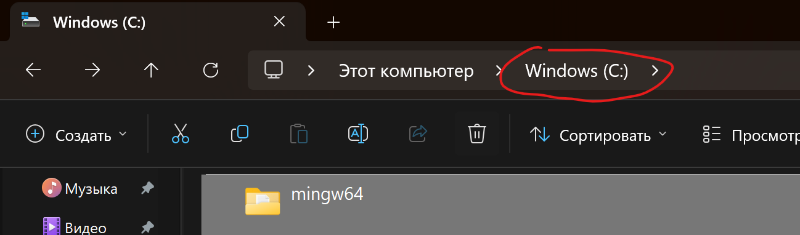
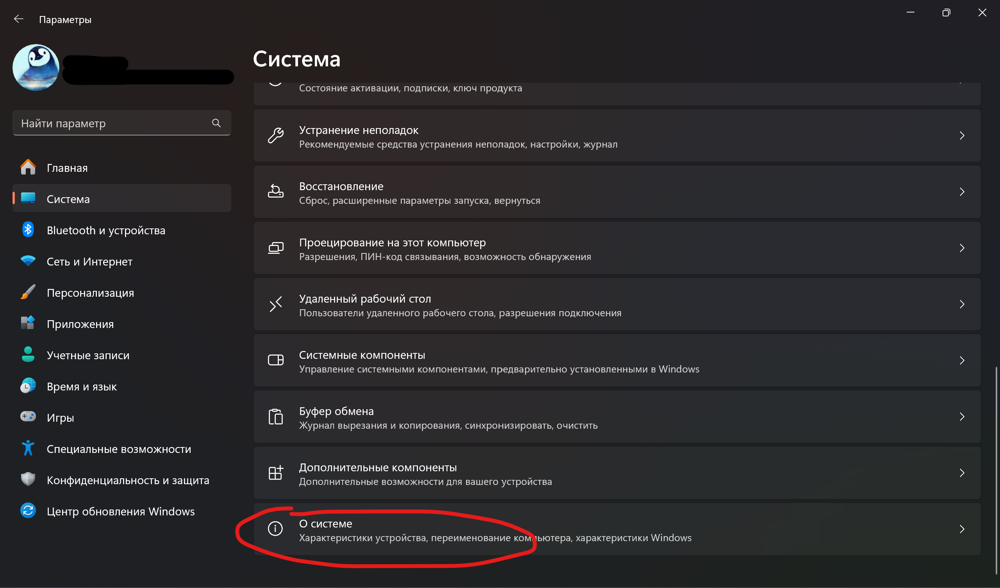
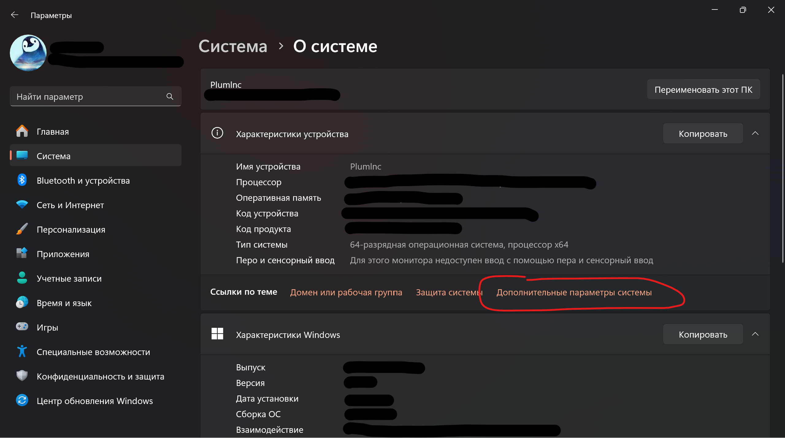
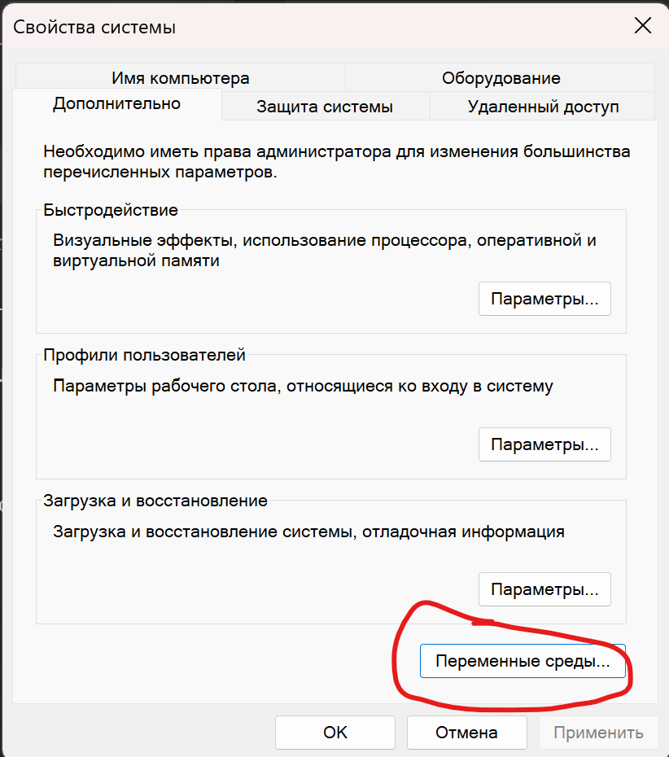
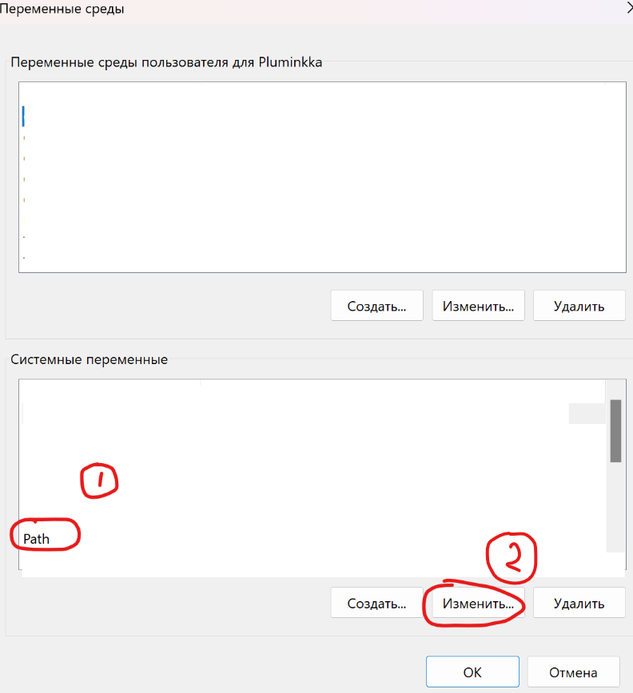
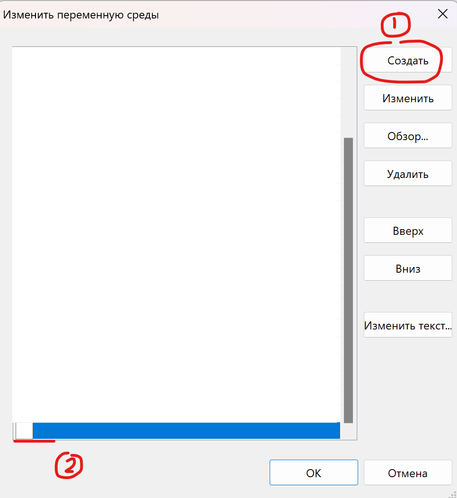
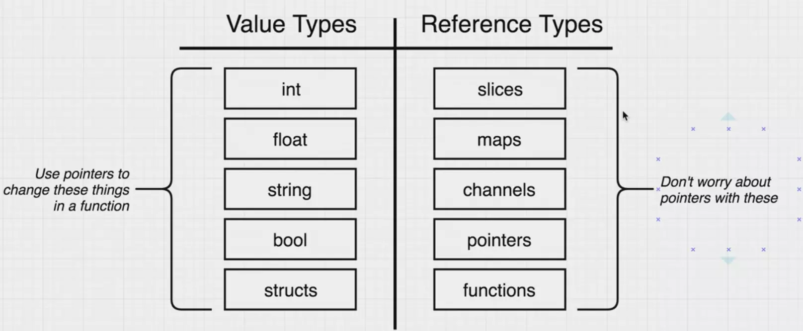

# GO 001 Fyne-01 INKKAPLUM SH

## 前文

GO 001 Fyne-01

本教程相比上一个的[Vue 教程](https://www.bilibili.com/video/BV1c142117Fz/)成熟了一些, 优势在于:

1. 教程内容重新安排, 因此课件集中在了一个文件, 没有对应的配置说明文件了, 这样看起来更直观方便。
2. 把 Go+Fyne 的学习过程和实战结合在一起, 避免了[上次](https://www.bilibili.com/video/BV1c142117Fz/)先学习了解重要的新语法和概念, 再上手实战项目的问题。
3. 桌面背景, 这一次背景换成了 Harumakigohan ゼロトーキング(Zero Talking)的背景, 看起来更加清晰, 而 Code 背景则是 Harumakigohan(はるまきごはん)的再会, 看起来亦更清晰, 也欢迎各位去听一听这两首曲子。

所以这一个教程的质量将会有提升, 同时依然满足了速成的要求。

## Up 的话(前言)

这是一个比较综合的 Go+Fyne 教程, Up 顾及到了很多基本概念, 因此没有学习过 Go 语言的朋友亦可以学习此内容, 但是之后依然需要花一定的时间学习 Go 基础, 当然不妨将这个视频作为你的你一个 Go 项目。

录制视频不仅是传递知识和解法, 也是对于 Up 自身的一个挑战和知识的再加强, 所以如果有任何不懂的地方, 尤其是视频没有讲清楚的地方, 欢迎私信问 Up 主, Up 主会尽力给出一个可用的解法。

当然, 欢迎关注 Up 的 B 站和知乎, 同时多多三连, 当然也可以充电支持 Up 主。大家的支持将给 Up 更多的动力, Up 也会努力给大家带来更好的视频。

同时, 所有课件和代码都在 GitHub 上开源地分享, 如果感到有帮助, 欢迎给一个 Star。

## 说明

本教程中全部文字版教程和代码为 B 站: [InkkaPlum 频道](https://space.bilibili.com/290859233)和知乎: [Inkka Plum](https://www.zhihu.com/people/instead-opt)的相关教程所用, 仅供学习。

不得二次用于任何机构/个人再次录制 Go / Fyne 或其它任何语言, 框架, 架构, 工具等等教程中。

但是非常欢迎修改案例项目或者添加更多功能。这个项目只是实现了基本的功能, 也有很多未完成的点。
此外, 下文有任何问题或者需要改进的点, 请联系 UP 主。

## 为什么要学习 Fyne?

### GUI Application 的定义

GUI(Graphical User Interface/图形用户界面)程序是指使用图形界面与用户进行交互的软件应用程序。图形界面通常包括窗口、图标、按钮、文本框、菜单等可视化元素, 使用户可以通过直观的操作(如点击、拖动, 输入内容)与程序进行交互, 而不需要通过如命令行进行操作。

例子: 好比 VS Code 就是。

使用 Fyne 开发 GUI(图形用户界面)程序有许多优势, 我们简单地和 Electron 比较一下。

### 1. **轻量**

- **Fyne**：Fyne 是一个轻量级的 GUI 框架, 应用程序的体积相对较小, 占用的系统资源也较少。
- **Electron**：Electron 打包了整个 Chromium 和 Node.js, 导致应用程序的体积较大, 并且在运行时占用不少内存。

### 2. **性能**

- **Fyne**：Fyne 应用是用 Go 语言编写的, Go 语言本身以其高效和快速的性能而闻名。Fyne 应用在启动和运行时的性能通常优于 Electron 应用。
- **Electron**：由于 Electron 依赖于 Chromium 和 Node.js, 其性能受限于这些底层技术的性能。Electron 应用启动较慢, 运行时占用较多的内存和 CPU 资源。

### 3. **资源消耗**

- **Fyne**：Fyne 应用程序消耗的系统资源较少, 特别是在内存和 CPU 使用方面。这使得 Fyne 应用在低配置的系统上也能顺畅运行。
- **Electron**：Electron 应用通常消耗更多的内存和 CPU 资源, 特别是在打开多个窗口或运行复杂的应用时, 这在低配置系统上可能会导致性能问题。

### 4. **开发语言**

- **Fyne**：Fyne 使用 Go 语言开发。Go 语言以其简洁、高效和强大的并发支持而著称, 非常适合开发高性能的服务器和桌面应用。
- **Electron**：Electron对于 Web 开发者而言则非常熟悉。

### 5. **其它优势**

- Fyne 提供了一套统一的、现代的用户界面, 能够在各个平台上看起来一致。其设计风格和用户体验都非常优雅。而得益于 Go 语言的编译特性，Fyne 应用在编译成二进制文件后，更难被逆向工程破解，从而在一定程度上增强了应用的安全性。

### 6. **Fyne 也有一些问题**

- Fyne 是一个相对较新的框架,虽然社区也在飞速发展, 但是肯定不能和 Electron 比, Electron 早已有了一个成熟的生态系统。

### 适用场景

- **Fyne**：适合开发轻量级、高性能、跨平台的桌面应用，尤其是在对资源消耗和性能要求较高的场景下。

- **Electron**：适合快速开发跨平台的桌面应用，尤其是已经有 Web 应用或有大量现成 Web 组件的场景。

### 对于本教程

本频道一直对于 Go 很重视, 有很多朋友对于 Go 的 Fyne 学习很有兴趣, 同时, Fyne 也很适合 Go 语言新手上手, 开发出一个不错的 GUI 程序。

### 关于热重载(Hot Reload)

定义: Hot Reload 允许开发者在不重新启动整个应用程序的情况下立即看到代码更改的效果。

通过热重载, 开发者可以大大提高效率。**而 Fyne 框架本身不直接内置热重载功能**

快速理解例子:

如 Vue.js 中，运行 `npm run dev`, 此命令启动了一个开发服务器, 监视项目中的文件变化, 并在检测到变化时自动重新编译, 而无需重新启动服务器。

## 配置基本环境

Go 环境配置

就在 Go 语言官网: <https://go.dev/dl/>

这里就不多多概述了, Up这里也是最新的版本。

但是, Fyne 需要一个如 MinGW-w64 的 C 编译器, 它需要 C 编译器来处理与系统图形驱动程序和其他底层系统组件的必要交互。

官方文档: <https://docs.fyne.io/started/>

我们这里大大简化了配置环境的步骤:

<https://sourceforge.net/projects/mingw-w64/files/>

我们直接地找到: `x86_64-win32-sjlj`即可, 然后我们下载, 解压即可。

直接放在 C 盘内, 如下图:



别忘了添加到 Path 里面。

方法是`System -> About -> Advanced System Settings -> Advanced -> Environment Variables -> System Variables 选择Path一栏, 然后点击Edit, 然后点击New, 然后C:\mingw64\bin 即可。`

这里我们已经添加好了, 请按照截屏操作即可:

第一步 找到 About

第二步 然后点击 Advanced System Settings

第三步 找到 Advanced 一栏, 点击下面的 Environment Variables

第四步 找到 Path 一栏, 点击, 然后点击 Edit

第五步 点击 New, 然后写上 C:\mingw64\bin 即可


现在我们就完成了基本的配置, 我们开始写代码吧。

## 第一个小项目

基本命令

```bash
go mod init fyneTest01
```

`fyneTest01`可以随便写。

```bash
go get fyne.io/fyne/v2
```

GOPATH 介绍说明

`$GOPATH` 是一个环境变量，它指定了你的 Go 工作空间的位置。工作空间中往往包含编译后的包文件和可执行文件。

如何找到它?

```bash
go env GOPATH
```

即可。

成品代码

```go
package main

import (
  "fmt"

  "fyne.io/fyne/v2/app"
  "fyne.io/fyne/v2/widget"
)

func main() {
  a:= app.New()
  w:= a.NewWindow("Gofer gogogo")

  w.SetContent(widget.NewLabel("Gofer gogogo"))
  w.ShowAndRun()

  fmt.Println("close!")
}
```

### Go 要点: `go mod tidy`

`go mod tidy` 命令会清理 go.mod 文件，移除不再需要的依赖，并确保所有实际使用的依赖都在文件中声明。同时，它还会更新 go.sum 文件，确保其中的记录是最新的和完整的。

```bash
go mod tidy
```

运行程序

```bash
go run .
```

即可

### Go 要点: `go run .`

参考文档 <https://shellytw.medium.com/golang-learning-journey-from-an-ex-javascript-developer-1-go-run-and-packages-d107fdff147>

这里的解释简单但是到位。
本教程将都使用这个命令。

### Fyne 要点: `w.ShowAndRun()`

Syntactic Sugar, 亦可以写成

```go
w.Show()
a.Run()
```

`a.run`将开启事件循环(Eventloop)

测试代码

```go
  fmt.Println("close!")
```

Fyne, 你不能同时有两个事件循环, 这是因为事件循环负责处理所有的事件(如用户输入)并协调应用程序中的所有组件和窗口。如果你尝试在同一个应用程序中运行多个事件循环,会导致不一致的状态 只能有一个事件循环。

## 处理多窗口问题

Fyne 支持在单个事件循环中管理多个窗口

```go
package main

import (
    "fyne.io/fyne/v2/app"
    "fyne.io/fyne/v2/container"
    "fyne.io/fyne/v2/widget"
)

func main() {
    a := app.New()

    w1 := a.NewWindow("Window 1")
    w1.SetContent(container.NewVBox(
        widget.NewLabel("Test01"),
    ))

    w2 := a.NewWindow("Window 2")
    w2.SetContent(container.NewVBox(
        widget.NewLabel("Test02"),
    ))

    w1.Show()
    w2.Show()
    a.Run()
}
```

## Go 内容

代码案例 01

```go
type Person struct{
    Name string
    Age int
    Email string
}

func main() {
    p := Person{
        Name:  "Inkka",
        Age:   17,
        Email: "inkkaplumbilibili@example.com",
    }

    // 访问结构体字段
    fmt.Println("Name:", p.Name)
    fmt.Println("Age:", p.Age)
    fmt.Println("Email:", p.Email)

    // 修改结构体字段
    p.Age = 18
    fmt.Println("Updated Age:", p.Age)
}
```

代码案例 02

```go
package main

import "fmt"

func main() {
    // 初始化一个整数变量 i
    i := 114514

    // 将 i 的值赋给 j
    j := i

    // 修改 j 的值
    j = 1919810

    // 打印 i 和 j 的值
    fmt.Println("i:", i) // 输出: i: 114514
    fmt.Println("j:", j) // 输出: j: 1919810
}
```

Go 没有引用类型

<https://github.com/golang/go/commit/b34f0551387fcf043d65cd7d96a0214956578f94>

代码案例 03

```go
package main

import "fmt"

func main(){
 a := 12

 b := &a

 *b = 13

 fmt.Println(a, *b)
}
```

代码案例 04

```go
type MyStruct struct {
    Name string
    age int
}

func NewMyStruct(name string, age int) *MyStruct {
    return &MyStruct{
        Name: name,
        age:  age,
    }
}
```

公式

```go
func (接收者变量 接收者类型) 方法名(参数列表) 返回类型 {
    函数体
}
```

代码案例 05

```go
package main

import "fmt"

type Person struct {
    name string
    age  int
}

func main() {
    p := NewPerson("Gopher", 17)
    p.Activity()
}

func NewPerson(name string, age int) *Person {
    return &Person{
        name: name,
        age:  age,
    }
}

func (p Person) Activity() {
    fmt.Println(p.name, p.age)
}
```

代码案例 06

```go
package main

import "fmt"

type Person struct {
    name string
}

func main() {
 person1 := Person{name: "Gopher"}

 person1.SetName()
 person1.Activity()
}

func (p *Person) SetName() {
    p.name = "Inkka"
   }

func (p Person) Activity() {
    fmt.Println(p.name + "在写代码")
}
```

TypeScript 参考例:

```go
setName(newName: string) {
        this.name = newName;  // 实例属性赋值
    }
```

参考图(图源 Yandex)



代码案例 07

```go
package main

import "fmt"

// 定义一个函数，接受一个 int 类型指针参数并修改它
func incrementByReference(val *int) {
    fmt.Println(1, val)
    *val++
    fmt.Println("Inside incrementByReference:", *val) // 输出: 11
}

func main() {
    num := 10
    fmt.Println(2, &num)
    incrementByReference(&num)
    fmt.Println("Outside incrementByReference:", num) // 输出: 11
}
```

代码案例 08

```go
package main

import "fmt"

// 定义一个函数，接受一个 int 类型参数并试图修改它
func incrementByValue(val int) {
    val++
    fmt.Println("Inside incrementByValue:", val) // 输出: 11
}

func main() {
    num := 10
    incrementByValue(num)
    fmt.Println("Outside incrementByValue:", num) // 输出: 10
}
```

代码案例 09

```go
type Animal interface {
    Speak() string
}
```

```go
type Animal interface {
    Speak(string) string
}

//补充: 这也可以
type Animal interface {
    Speak(s string) string
}
```

代码案例 10

```go
package main

import "fmt"

// 定义 Animal 接口
type Animal interface {
    Speak() string
}

// 定义 Dog 结构体
type Dog struct {
    name string
}

// 定义 Cat 结构体
type Cat struct {
    name string
}

// Dog 实现 Animal 接口的 Speak 方法
func (d Dog) Speak() string {
    return "Woof!"
}

// Cat 实现 Animal 接口的 Speak 方法
func (c Cat) Speak() string {
    return "Nya!"
}

// 一个函数，接受 Animal 类型的参数
func MakeAnimalSpeak(a Animal) {
    fmt.Println(a.Speak())
}

func main() {
    dog := Dog{name: "Inu"}
    cat := Cat{name: "Neko"}

    // Dog 和 Cat 类型都实现了 Animal 接口
    MakeAnimalSpeak(dog) // 输出: Woof!
    MakeAnimalSpeak(cat) // 输出: Nya!
}
```

## 更复杂的项目

### 要求和最终效果

再一次体验 Container, 点击按钮能够实现对应的效果。

参考[任意一篇 Fyne 官方文档](https://docs.fyne.io/started/testing), 可以看到写法:

```go
func makeUI() (*widget.Label, *widget.Entry) {
  return widget.NewLabel("Hello world!"),
    widget.NewEntry()
}

func main() {
  a := app.New()
  w := a.NewWindow("Hello Person")

  w.SetContent(container.NewVBox(makeUI()))
  w.ShowAndRun()
}
```

所以, 我们也会写`makeUI()`。

#### 优势

1. 逻辑清晰
2. 便于测试

#### 读法的小提示

`*...` 可以读成`Pointer to ...`。

#### 成品代码

```go
package main

import (
 "fmt"

 "fyne.io/fyne/v2"
 "fyne.io/fyne/v2/app"
 "fyne.io/fyne/v2/container"
 "fyne.io/fyne/v2/widget"
)

type App struct{
 output *widget.Label
}

var myApp App

func (app *App) makeUI()(*widget.Label, *widget.Entry, *widget.Button, *widget.Label, *widget.Button ){
 output := widget.NewLabel("Gopher Go go go")
 entry:= widget.NewEntry()
 btn := widget.NewButton("Click!", func() {
  output.SetText(entry.Text)
 })

 app.output = output

 btn.Importance = widget.HighImportance

 number := 0
 count := widget.NewLabel(fmt.Sprintf("Current Number: %d", number))
 incrementbtn := widget.NewButton("Click again!", func() {
  number++
  count.SetText(fmt.Sprintf("Current Number: %d", number))
 })

 incrementbtn.Importance = widget.DangerImportance

 return output, entry, btn, count, incrementbtn
}

func main() {
 a := app.New()
 w := a.NewWindow("Gopher Go go go!02")

 output, entry, btn, count, incrementbtn := myApp.makeUI()

 w.SetContent(container.NewVBox(output, entry, btn, count, incrementbtn))

 w.Resize(fyne.Size{Width: 1600, Height: 1000})

 w.ShowAndRun()
}
```

## 综合项目 01 Markdown 编辑器

### 此项目的要求和最终效果

能够支持中文, 程序窗口左半边写 markdown, 右边则显示富文本, 也就是现在我们 Vs code 里面的 Preview(プレビュー)

### 解决语言问题

Fyne 默认字体不支持中文, 我们可以复制一下下面的测试文本, 基于我们第一个案例, 会发现是乱码。

```go
package main

import (
  "fmt"

  "fyne.io/fyne/v2/app"
  "fyne.io/fyne/v2/widget"
)

func main() {
  a:= app.New()
  w:= a.NewWindow("让我们一起来学习Go语言吧!")

  w.SetContent(widget.NewLabel("让我们一起来学习Go语言吧!"))
  w.ShowAndRun()

  fmt.Println("close!")
}
```

在项目文件夹中(必要文件), 找到字体文件(NotoSansHans-Regular.ttf)或者亦可以用你喜好的字体。将项目文件夹中的`theme.go`和`util.go`复制到项目目录下。

然后, 在项目中添加如下代码:

```go
customFont := fyne.NewStaticResource("NotoSansHans.ttf", loadFont("NotoSansHans-Regular.ttf"))
a.Settings().SetTheme(&myTheme{font: customFont})

```

只需要改`loadFont`内的内容即可。

### 实战 Struct 和 Receiver

```go
package main

import (
 "fyne.io/fyne/v2"
 "fyne.io/fyne/v2/app"
 "fyne.io/fyne/v2/container"
 "fyne.io/fyne/v2/widget"
)

type config struct {
 EditWidget    *widget.Entry
 PreviewWidget *widget.RichText
 CurrentFile   fyne.URI
 MenuItem  *fyne.MenuItem
}
```

### 正式写代码

`container.NewHSplit`对应的文档:
<https://docs.fyne.io/api/v2.4/container/split.html>

#### URI URL 辨析

1. URI 是一个用于标识资源的字符串, 它可以是资源的名称、位置或两者的结合。URI 的概念是一个广义的概念, 包含了两类子集：URL 和 URN。

2. URL(统一资源定位符)
   URL 是 URI 的一个子集, 用于指定资源的位置。URL 不仅标识资源, 还提供了定位资源的方法。URL 通常包括以下部分：

方案(Scheme): 例如 http、https、ftp 等，表示访问资源的协议。
主机(Host): 资源所在的主机名或 IP 地址。
路径(Path): 资源在主机上的具体位置。
查询参数(Query Param): 附加的参数信息，用于传递额外的数据。
片段(Fragment): 资源的一部分，例如网页中的一个锚点。

举一个例子(锚点): <https://ja.wikipedia.org/wiki/Go_(プログラミング言語)#interface>

案例

```url
https://example.com/path/to/resource?query=param#fragment
```

URI例子

```bash
file:///Users/username/Documents/example.md
```

代码是最终成品

### Filter(筛选器)

代码

```go
var filter = storage.NewExtensionFileFilter([]string{".md", ".MD"})
```

提示:

```go
func HasSuffix(s, suffix string) bool {
 return len(s) >= len(suffix) && s[len(s)-len(suffix):] == suffix
}
```

表示方法

```go
s[len(s)-len(suffix):]
```

假设 s 为`example.md`

### 放在不同的文件中

#### 目录说明

```md
myapp/
|-- main.go
|-- test.go
```

`main.go`及`test.go`第一行

```go
package main
```

main.go更多代码

```go
func main() {
    ... ...
}
```

附注: 只要在同一个包, 顶层变量和函数就可以互相自由访问。

#### 生成一个图标

随意地找一个生成器即可, 格式要求 Icon.png

#### 最终目录

```md
myapp/
|-- main.go
|-- ui.go
|-- config.go
```

这里只有 Import 相关的内容

`config.go`

```go
import (
 "io"
 "strings"

 "fyne.io/fyne/v2"
 "fyne.io/fyne/v2/dialog"
 "fyne.io/fyne/v2/storage"
)
```

`ui.go`

```go
import (
 "fyne.io/fyne/v2"
 "fyne.io/fyne/v2/widget"
)
```

`main.go`

```go
import (
 "fyne.io/fyne/v2"
 "fyne.io/fyne/v2/app"
 "fyne.io/fyne/v2/container"
 "fyne.io/fyne/v2/widget"
)
```

## 综合代码

`main.go`

```go
type config struct {
 EditWidget *widget.Entry
 PreviewWidget *widget.RichText
 CurrentFile fyne.URI
 MenuItem *fyne.MenuItem
 BaseTitle string
}

var cfg config

var filter = storage.NewExtensionFileFilter([]string{".md", ".MD"})

func main() {
 a := app.New()

 customFont := fyne.NewStaticResource("NotoSansHans.ttf", loadFont("NotoSansHans-Regular.ttf"))
 a.Settings().SetTheme(&myTheme{font: customFont})

 w := a.NewWindow("Markdown编辑器")
 cfg.BaseTitle = "Markdown编辑器"

 edit, preview := cfg.makeUI()
 cfg.createMenu(w)

 w.SetContent(container.NewHSplit(edit, preview))
 w.Resize(fyne.Size{Width: 800, Height: 600})
 w.CenterOnScreen()
 w.ShowAndRun()
}
```

`ui.go`

```go
package main

import (
 "fyne.io/fyne/v2"
 "fyne.io/fyne/v2/widget"
)

func (cfg *config) makeUI() (*widget.Entry, *widget.RichText){
 edit := widget.NewMultiLineEntry()
 preview := widget.NewRichTextFromMarkdown("")

 cfg.EditWidget = edit
 cfg.PreviewWidget = preview

 edit.OnChanged = preview.ParseMarkdown

 return edit, preview
}

func (cfg *config) createMenu(win fyne.Window){
 open := fyne.NewMenuItem("打开...", cfg.openFunc(win))
 save := fyne.NewMenuItem("保存", cfg.saveFunc(win))
 cfg.MenuItem = save
 cfg.MenuItem.Disabled = true

    saveAs := fyne.NewMenuItem("另存为...", cfg.saveAsFunc(win))

 fileMenu := fyne.NewMenu("文件", open, save, saveAs)

 menu := fyne.NewMainMenu(fileMenu)

 win.SetMainMenu(menu)
}
```

`config.go`

```go
package main

import (
 "io/ioutil"
 "strings"

 "fyne.io/fyne/v2"
 "fyne.io/fyne/v2/dialog"
 "fyne.io/fyne/v2/storage"
)

func (cfg *config) saveAsFunc(win fyne.Window) func(){
 return func(){
  saveDialog := dialog.NewFileSave(func(write fyne.URIWriteCloser, err error){
   if err != nil{
    dialog.ShowError(err, win)
    return 
   }
   
   if write == nil{
    return 
   }

   if !strings.HasSuffix(strings.ToLower(write.URI().String()),".md"){
    dialog.ShowInformation("错误", "必须是.md扩展名", win)
    return
   }

   write.Write([]uint8(cfg.EditWidget.Text))

   cfg.CurrentFile = write.URI()

   defer write.Close()

   win.SetTitle(cfg.BaseTitle + "-" + write.URI().Name())
   cfg.MenuItem.Disabled = false
  },win)
  saveDialog.SetFileName("未命名.md")
  saveDialog.SetFilter(filter)
  saveDialog.Show()
 }
}

func (cfg *config) openFunc(win fyne.Window) func() {
 return func(){
  openDialog := dialog.NewFileOpen(func(read fyne.URIReadCloser, err error){
   if err!=nil{
    dialog.ShowError(err,win)
    return 
   }
   if read == nil{
    return
   }

   data, err := io.ReadAll(read)
   if err!=nil{
    dialog.ShowError(err,win)
    return
   }

   defer read.Close()

   cfg.EditWidget.SetText(string(data))

   cfg.CurrentFile = read.URI()

   win.SetTitle(cfg.BaseTitle + "-" + read.URI().Name())

   cfg.MenuItem.Disabled = false
  },win)
  openDialog.SetFilter(filter)
  openDialog.Show()
 }
}

func (cfg *config) saveFunc(win fyne.Window) func() {
 return func(){
  if cfg.CurrentFile != nil{
   write, err := storage.Writer(cfg.CurrentFile)
   if err != nil{
    dialog.ShowError(err, win)
    return
   }

   write.Write([]byte(cfg.EditWidget.Text))
   defer write.Close()
  }
 }
}
```

## 测试文件

### 对应成品代码

```go
package main

import (
 "testing"

 "fyne.io/fyne/v2/container"
 "fyne.io/fyne/v2/test"
)

func Test_makeUI(t *testing.T){
 var testCfg config
 edit, preview := testCfg.makeUI()

 test.Type(edit, "Gofjer")

 if preview.String() != "Gofjer"{
  t.Error("Failed!!!!")
 }
}
```

### 打包项目

参考此文档即可: <https://docs.fyne.io/started/packaging.html>

## 综合项目 02 - 趣味整活项目

### 全部代码

```go

package main

import (
 "time"

 "fyne.io/fyne/v2"
 "fyne.io/fyne/v2/app"
 "fyne.io/fyne/v2/container"
 "fyne.io/fyne/v2/dialog"
 "fyne.io/fyne/v2/widget"
)

func main() {
 // 创建一个 Fyne 应用
 a := app.New()
 // 创建一个窗口
 customFont := fyne.NewStaticResource("NotoSansHans.ttf", loadFont("NotoSansHans-Regular.ttf"))
 a.Settings().SetTheme(&myTheme{font: customFont})

 win := a.NewWindow("高端检测器")

 // 创建一个按钮
 btn := widget.NewButton("检测是否开机", func() {
  // 创建一个进度条
  progress := widget.NewProgressBarInfinite()
  progressContainer := container.NewVBox(progress)

  // 显示加载动画
  loadingDialog := dialog.NewCustom("正在检测...", "取消", progressContainer, win)
  loadingDialog.Show()

  // 模拟加载时间
go func(){

 time.Sleep(10 * time.Second) // 10 秒模拟加载时间

 // 关闭加载动画并弹出结果窗口
 loadingDialog.Hide()
 dialog.ShowInformation("结果", "电脑是开机的", win)
}()

 })

 // 设置窗口内容
 win.SetContent(container.NewVBox(btn))
 win.Resize(fyne.Size{Width: 400, Height: 200})
 win.CenterOnScreen()
 win.ShowAndRun()
}
```

### Go goroutine 简单概念

Goroutine 是 Go 语言中的一种轻量级线程, 由 Go 运行时管理。Goroutine 使得并发编程变得更加简单和高效，可以通过关键字 `go` 启动。

当然, 每一个并发执行的活动称为goroutine。当一个程序启动时, 只有一个goroutine来调用main函数, 称之为主goroutine。

#### 特点

1. **轻量级**：

   - Goroutine 非常轻量级, 可以在同一个程序中启动成千上万个 Goroutine, 而不会造成过多的内存开销。

2. **易于使用**：

   - 只需在**函数调用前加上 `go` 关键字**, 即可启动一个新的 Goroutine。

3. **并发执行**：

   - Goroutine 可以并发执行, 不同的 Goroutine 之间可以独立运行, 互不干扰。

4. **调度器管理**：
   - Go 运行时会自动管理 Goroutine 的调度, 充分利用多核处理器的优势。

#### Goroutine 示例

以下是一个简单的 Goroutine 示例：

```go
package main

import (
 "fmt"
 "time"
)

func sayHello() {
 for i := 0; i < 5; i++ {
  fmt.Println("Hello")
  time.Sleep(1 * time.Second)
 }
}

func main() {
 go sayHello() // 启动一个新的 Goroutine 执行 sayHello 函数

 // 主 Goroutine 继续执行其他代码
 for i := 0; i < 5; i++ {
  fmt.Println("World")
  time.Sleep(1 * time.Second)
 }

 // 等待 sayHello 函数执行完成
 time.Sleep(6 * time.Second)
}
```

输出情况:

由于 sayHello 函数在一个新的 goroutine 中执行, 而 main 函数继续执行, 两个函数的输出将会交错在一起。具体的输出可能会有所不同, 有可能是如下面这样

```md
World
Hello
World
Hello
...
```

而Up主的案例是这样。

```md
World
Hello
Hello
World
World
Hello
Hello
World
World
Hello
```

上文这就是 Goroutine 的一个非常好的案例, 可以暂停视频仔细阅读分析一下。

## 总结

以上就是全部内容, 如果有任何问题, 欢迎私信 UP 主反馈!

这是一个比较综合的 Go+Fyne 教程, Up 顾及到了很多基本概念, 因此没有学习过 Go 语言的朋友亦可以学习此内容, 但是之后可能需要花一定的时间学习 Go 基础。

此外, 欢迎关注 Up 的 B 站频道和知乎, 并且别忘了一键三连, 当然如果愿意, 欢迎给 Up 充电支持, 您的支持是 Up 前进的动力, 将会鼓励 Up 给各位带来更好的视频。

同时, 所有课件和代码都在 GitHub 上分享, 如果感到有帮助, 欢迎给一个 Star。

扩充内容: 之后还会有一个 Fyne 教程, Up 会运用多窗口为我们的 markdown 编辑器增加一些功能, 与此同时, 还会用 Fyne 实现我们之前 Vue 案例中的蓝鼠兑换项目, 敬请期待!

Up B 站 InkkaPlum 频道

<https://space.bilibili.com/290859233>

Up 知乎

<https://www.zhihu.com/people/instead-opt>

Up 掘金

<https://juejin.cn/user/3529872175284560>

Up GitHub

<https://github.com/Slumhee>

以上 祝学习成功!

Inkka Plum
